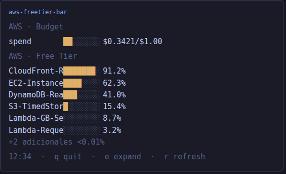

# AWS Free Tier Bar

Herdr plugin. Shows an AWS spend safety tripwire and per-service Free Tier quota usage
in a small persistent pane. No credit balance to track (this isn't a prepaid coupon),
just a budget cap you set, and how close each service you're actually using is to its
real Free Tier limit.



Sample data above, not a real account. Sorted by risk: CloudFront near its limit, Lambda
barely touched.

## Requirements

- Linux
- `aws` CLI on `PATH`, already authenticated (`aws configure`, or credentials resolved
  by whatever wrapper you already use)
- `jq` and `bc` on `PATH`

No API key is stored by this plugin. If `aws` is missing or not authenticated, the pane
shows the real error instead of staying blank, and you can retry with `r` once it's fixed.

## Install

```bash
herdr plugin install CristianPeralta/herdr-aws-freetier-bar
```

For local dev (edits reflect without reinstalling):

```bash
herdr plugin link ~/code/herdr-aws-freetier-bar
```

## Usage

```bash
herdr plugin action invoke aws-freetier-bar.open
```

Opens (or reuses, if already open) a small pane below the current one, refreshing every 30
minutes. Press `r` inside the pane to refresh now, `e` to expand/collapse Free Tier rows
below 0.01%, `q` to stop.

### Budget cap

The budget line is a $1.00 safety tripwire, not a spend plan. Edit `BUDGET_CAP` at the
top of `providers/aws.sh` if you want a different ceiling.

## Feedback

Feedback, bug reports, and PRs welcome via GitHub Issues.

## License

MIT
